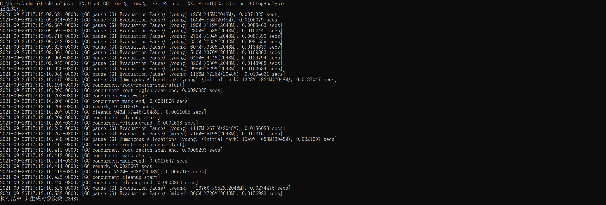

# 不同GC和堆内存的总结

## 测试代码
GCLogAnalysis.java

## 本地环境

JDK8
Windows 10系统

## 测试内容

分别测试了从 512m 1g 2g 到 4g 不通垃圾回收器下创建对象数量以及full gc时间大小对比

### 串行GC

java -XX:+UseSerialGC -Xms512m -Xmx512m -XX:+PrintGCDetails -XX:+PrintGCDateStamps GCLogAnalysis

young gc 时间稍微增加，次数增加，22次， full gc没有发生，但是对象数量翻倍吞吐量增加

java -XX:+UseSerialGC -Xms1g -Xmx1g -XX:+PrintGCDetails -XX:+PrintGCDateStamps GCLogAnalysis

young gc 时间稍微增加，次数增加，22次， full gc没有发生，但是对象数量翻倍吞吐量增加

java -XX:+UseSerialGC -Xms2g -Xmx2g -XX:+PrintGCDetails -XX:+PrintGCDateStamps GCLogAnalysis

young gc 时间增加到3~4ms，次数明显减少 ，full gc没有发生

java -XX:+UseSerialGC -Xms4g -Xmx4g -XX:+PrintGCDetails -XX:+PrintGCDateStamps GCLogAnalysis

young gc 时间增加到4~7ms，次数减少 ，full gc没有发生

java -XX:+UseSerialGC -Xmx4g -XX:+PrintGCDetails -XX:+PrintGCDateStamps GCLogAnalysis

不配置Xms的情况下：young gc 时间增加到7~16ms，次数增加 ，full gc没有发生

### 串行GC总结

可以看到在堆内存越来越大时候，创建对象数量次数不断增加，young gc次数也慢慢变少gc时间越来越长，几乎是指数上升，Full gc的次数也是不断减少，每次时间也相应增加。

同时我们可以看出在不配置Xms的情况下Gc次数也是不断增加的。每次暂停时间几倍的增加

### 并行GC

java -XX:+UseParallelGC -Xms512m -Xmx512m -XX:+PrintGCDetails -XX:+PrintGCDateStamps GCLogAnalysis

young gc 32次，时间大概在 1ms左右 ， full gc 15次，时间大概 2ms ~ 3ms 左右，对象数量相比串行GC都是不如的

java -XX:+UseParallelGC -Xms1g -Xmx1g -XX:+PrintGCDetails -XX:+PrintGCDateStamps GCLogAnalysis

young gc 37次，时间大概在 1ms左右 ， full gc 3次，时间大概 3ms 左右，对象数量翻倍。从次数来说yong区的次数增加，但是吞吐量也获得很大提升，full gc次数减少，每次暂停时间没有明显的增加。

java -XX:+UseParallelGC -Xms2g -Xmx2g -XX:+PrintGCDetails -XX:+PrintGCDateStamps GCLogAnalysis

第一次full GC发生在第20次，yong gc一共发生21次，时间大概 10~20ms 左右，次数减少，full gc 发生一次4ms。暂停时间稍微增加，对象次数提升

java -XX:+UseParallelGC -Xms4g -Xmx4g -XX:+PrintGCDetails -XX:+PrintGCDateStamps GCLogAnalysis

yong gc一共发生8次，次数减少，full gc 没发生，暂停时间稳定在20~30ms，对象次数提升

java -XX:+UseParallelGC -Xmx4g -XX:+PrintGCDetails -XX:+PrintGCDateStamps GCLogAnalysis

同样去除Xms配置，yong gc一共发生15次，次数增加，时间为4~25ms，full gc 4次，次数增加，时间为1~4ms，对象次数减少

### 并行GC总结

可以看到在堆内存越来越大时候，创建对象数量次数不断增加，young gc次数不断减少gc时间越来越长，但是增加的幅度不大，Full gc的次数也是不断减少，每次时间也缓慢增加。

同时我们可以看出在不配置Xms的情况下gc次数也是增加的。暂停时间也相对比较长

同串行相比较，512m的配置下，并行gc总体不如串行gc，1g以后虽然并行gc 的次数稍微多一些，但是暂停时间极短，对象次数也比较多。

### CMS GC

java -XX:+UseConcMarkSweepGC -Xms512m -Xmx512m -XX:+PrintGCDetails -XX:+PrintGCDateStamps GCLogAnalysis

吞吐量有很大的提升，一万多。young gc 时间大概在 6-30ms左右不等，比较慢，次数多， full gc时间1ms左右，发生了14次

java -XX:+UseConcMarkSweepGC -Xms1g -Xmx1g -XX:+PrintGCDetails -XX:+PrintGCDateStamps GCLogAnalysis

吞吐量翻倍。young gc 时间大概在 10-30ms左右不等，比较慢，次数明显减少， full gc时间1ms左右，发生了3次

java -XX:+UseConcMarkSweepGC -Xms2g -Xmx2g -XX:+PrintGCDetails -XX:+PrintGCDateStamps GCLogAnalysis

吞吐量增加。young gc 时间大概在 17-47ms左右不等，比较慢，次数减少， full gc时间1ms左右，发生了1次

java -XX:+UseConcMarkSweepGC -Xms4g -Xmx4g -XX:+PrintGCDetails -XX:+PrintGCDateStamps GCLogAnalysis

吞吐量增加。young gc 时间大概在 20-60ms左右不等，比较慢，次数减少， full gc没发生

java -XX:+UseConcMarkSweepGC -Xmx4g -XX:+PrintGCDetails -XX:+PrintGCDateStamps GCLogAnalysis

去除Xms配置，吞吐量减少将近一半。young gc 时间有个很好的改善，大概在 1-20ms左右不等，次数明显增加， full gc发生2次

### CMS GC总结

可以看到在堆内存越来越大时候，创建对象数量次数不断增加，young gc次数不断减少gc时间越来越长，暂停时间相对较长，Full gc的次数不断减少，但是每次暂停时间没什么变化。

同时我们可以看出在不配置Xms的情况下gc次数是增加的。但是暂停时间却减少了

同串行并行相比较，吞吐量不如并发甚至串行收集器，垃圾回收时间与并行回收相差无异。

### G1 GC

java -XX:+UseG1GC -Xms512m -Xmx512m -XX:+PrintGC -XX:+PrintGCDateStamps  GCLogAnalysis

大概创建对象数量在 1w左右 young gc 时间10ms以内， full gc时间大概 27ms发生三次，GC总共发生了50左右

java -XX:+UseG1GC -Xms1g -Xmx1g -XX:+PrintGC -XX:+PrintGCDateStamps  GCLogAnalysis

大概创建对象数量在 1w5左右 young gc 时间10~30ms以内， full gc没发生，GC总共发生了30次左右

java -XX:+UseG1GC -Xms2g -Xmx2g -XX:+PrintGC -XX:+PrintGCDateStamps  GCLogAnalysis

大概创建对象数量在 2w3左右 young gc 时间10~30ms以内， full gc没发生，GC总共发生了十几次

java -XX:+UseG1GC -Xms4g -Xmx4g -XX:+PrintGC -XX:+PrintGCDateStamps  GCLogAnalysis

大概创建对象数量在 2w4左右 young gc 时间10~40ms以内， full gc没发生，GC总共发生了15次

java -XX:+UseG1GC -Xmx4g -XX:+PrintGC -XX:+PrintGCDateStamps  GCLogAnalysis

大概创建对象数量在 1w5左右 young gc 时间10~30ms以内， full gc没发生，GC总共发生了13次

### G1 GC总结

同CMS相近，优化了年轻代的处理时间。兼顾了吞吐量和停顿时间的GC实现。

### 结论

1.随着堆内存的不断扩大，创建对象的次数不断增加，yong区和old区的出发次数也会不断减少，同时每次处理的时间也会增加。

2.同等内存大小情况下 串行gc 时间 几乎是 并行gc的两倍倍

3.可以看到内存越大g1越优于串行 并行 以及 cms 不管是从吞吐量和gc时间来说，内存越大的情况下 G1 回收的效率越高，gc时间比其他回收器时间短、内存越大g1效果越好

4.cms 于 吞吐量相对于其他回收器明显存在劣势，回收时间不太稳定

5.并不是堆内存越大，效果越好，每次gc处理的时间会拉长。也不是堆内存越小，越频繁的处理gc就越好，需要去找一个平衡的适合的配置

